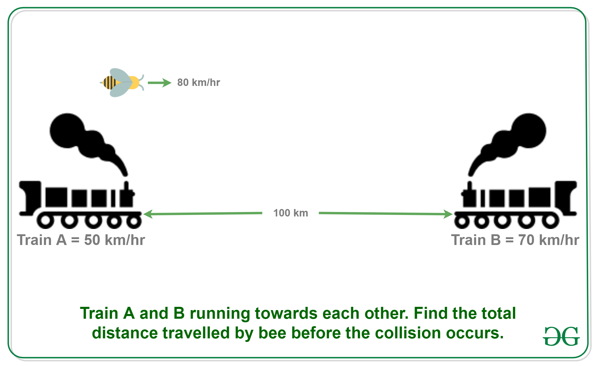

### Puzzle 3

Puzzle: Two trains are on same track and they are coming toward each other. The speed of the first train is 50 km/h and the speed of the second train is 70 km/h. A bee starts flying between the trains when the distance between two trains is 100 km. The bee first flies from first train to second train. Once it reaches the second train, it immediately flies back to the first train … and so on until trains collide. Calculate the total distance travelled by the bee. Speed of bee is 80 km/h. 

u = 50 km/hr
v = 70 km/hr
d = 100 km
b = 80 km/hr

Therefore, the total distance travelled by bee 
= b*d/(u+v) 
= 80 * 100/(50+70) 
= 66.67 km (approx)

1. **Understanding \( d/(u+v) \)**:
   - The expression \( d/(u+v) \) calculates the **time** until the collision, as we saw in the previous solution. This is because \( u + v \) is the combined speed of the trains (the rate at which the distance between them closes), and \( d \) is the initial distance between them.
   - So, \( d/(u+v) \) gives the **time** it takes for the trains to collide.

2. **Multiplying by the Bee's Speed, \( b \)**:
   - Since the bee flies continuously from one train to the other until they collide, the **total distance the bee travels** is simply its speed multiplied by the time it has to fly.
   - This is why we multiply by \( b \) (the bee’s speed) to get the distance.

3. **Final Formula**:
   - Putting it together, we get:
     \[
     \text{Total distance traveled by bee} = b \times \frac{d}{u + v}
     \]
   - This formula combines the time until collision and the bee's speed in one step.

### Step-by-Step:
Given:
- \( b = 80 \, \text{km/h} \) (bee's speed)
- \( d = 100 \, \text{km} \) (distance between trains)
- \( u + v = 120 \, \text{km/h} \) (combined speed of trains)

Substitute into the formula:
\[
\text{Total distance traveled by bee} = 80 \times \frac{100}{120} = 80 \times \frac{5}{6} = 66.67 \, \text{km}
\]

This approach is a concise way to calculate the total distance without calculating time as an intermediate step, by directly applying the bee’s speed over the time window provided by the collision.
